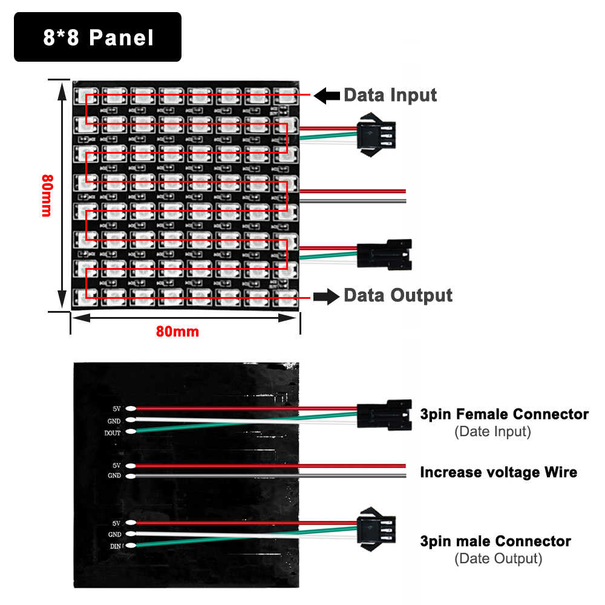

# Electronische-fakkel

## Benodigde materialen & gereedschap

* Arduino micro of Arduino nano (makkelijk aan te sluiten vanwege de USB connector) optioneel kan een andere Arduino ook of een ESP8266 of ESP32 maar dan moet je meer solderen.
* (Optioneel) Elektrolytische condensator van 470 uF of meer (10V of meer)
* 8 x 32 pixel flexibel ws2812 matrix
  Verkrijgbaar bij o.a. de volgende webshops:
  * https://nl.aliexpress.com/item/33025679652.html
  * https://www.hobbyelectronica.nl/product/8x32-rgb-ws2812b-led-flex-module/?gclid=EAIaIQobChMI5fu85tn_7wIVhaZ3Ch3kEw4IEAQYAiABEgJ_G_D_BwE
  * https://nl.grandado.com/products/ws2812b-led-digitale-flexibele-dc5v-individueel-adresseerbare-panel-licht-ws2812-8x8-16x16-8x32-module-matrix-scherm?variant=32322300903477
  * https://www.amazon.nl/dp/B07KT1H481
  * https://www.tinytronics.nl/shop/nl/diversen/led-matrix/ws2812b-digitale-5050-rgb-led-matrix-32x8-flexibel

* Soldeergereedschap (soldeerbout met medium of kleine punt en soldeer)
* ducttape

## Instructies

